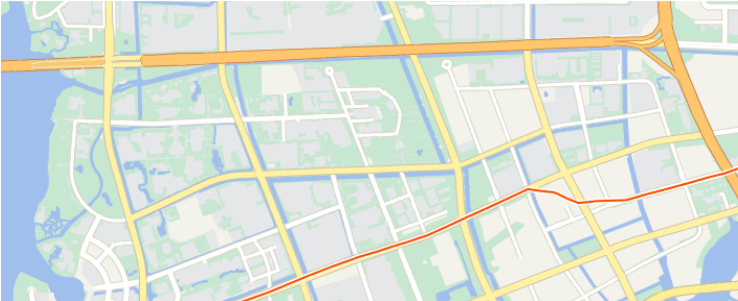
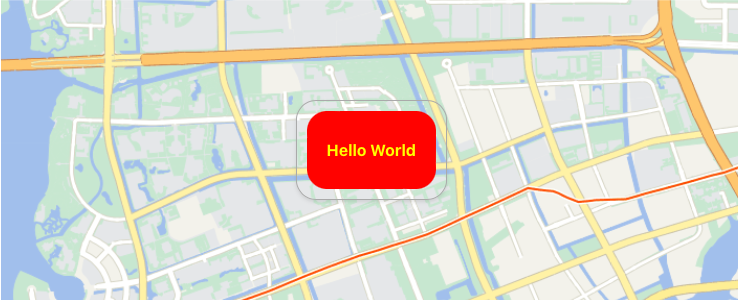
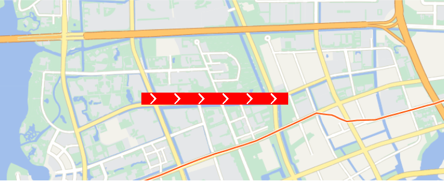

English | [🇨🇳中文](README_ZH.md)

# Cesium Components Vue

<p align="center">
    <a href="https://cesium.sunquakes.com/" target="_blank" rel="noopener noreferrer">
        
    </a>
</p>
<p align="center">
    
    
    
</p>

## Documentation

Visit [cesium.sunquakes.com](https://cesium.sunquakes.com).

## Install

- Import Cesium js and css file in index.html.

```html
<script type="text/javascript" src="/path/to/Cesium.js"></script>
<link rel="stylesheet" href="/path/to/Widgets/widgets.css" />
```

- Install `cesium-components-vue`

```bash
pnpm install cesium-components-vue
```

## Getting Started

- Use it in `Vue 3`.

```ts
<template>
  <div class="viewer">
    <cc-tian-viewer v-model="viewer" :tk="tk" :id="containerId"></cc-tian-viewer>
  </div>
</template>

<script lang="ts" setup>
import { ref, watch } from 'vue'

const viewer = ref(null)
const tk = 'map-world-tk' // Obtained from `Map World` website.
const containerId = 'default'

watch(viewer, async (newValue) => {
  const viewer = newValue as Cesium.Viewer
  viewer.camera.flyTo({
    destination: Cesium.Cartesian3.fromDegrees(120.74210547619033, 31.275160096694293, 5000)
  })
})
</script>

<style>
.viewer {
  margin-top: 10px;
  width: 100%;
  height: 300px;
}
</style>
```

## Example

<div>
    <a target="_blank" href="https://cesium.sunquakes.com/guide/viewer.html#default-color">
        
    </a>
    <a target="_blank" href="https://cesium.sunquakes.com/guide/popup.html#example">
        
    </a>
</div>
<div>
    <a target="_blank" href="https://cesium.sunquakes.com/guide/material.html#polyline">
        
    </a>
</div>

## License

[Apache-2.0 license](/LICENSE)
