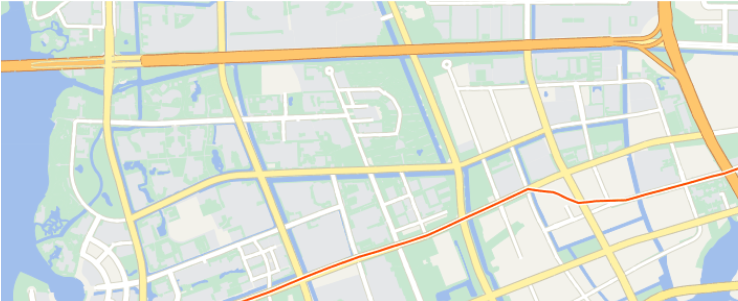

[English](README.md) | 🇨🇳中文

# Cesium Components Vue

<p align="center">
    <a href="https://cesium.sunquakes.com/zh" target="_blank" rel="noopener noreferrer">
        
    </a>
</p>
<p align="center">
    
    
    
</p>

## 文档 

访问 [cesium.sunquakes.com](https://cesium.sunquakes.com).

## 开始

```bash
pnpm install cesium-components-vue
```

## 样例

<p>
    <a target="_blank" href="https://cesium.sunquakes.com/zh/guide/viewer.html#default-color">
        
    </a>
    <a target="_blank" href="https://cesium.sunquakes.com/zh/guide/popup.html#example">
        
    </a>
<p>
</p>
    <a target="_blank" href="https://cesium.sunquakes.com/zh/guide/material.html#polyline">
        
    </a>
</p>

## 证书

[Apache-2.0 license](/LICENSE)

